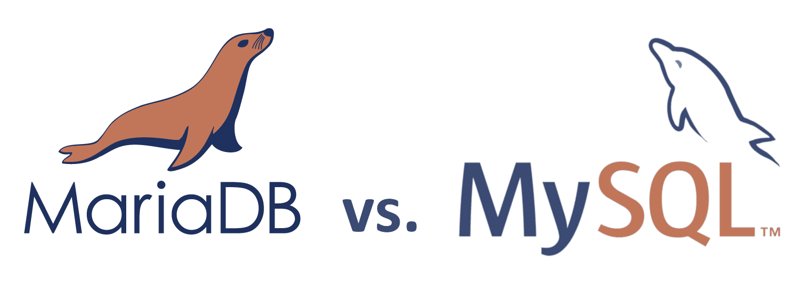

# Title: Learning about databases

- Repository: `NA`
- Type of Challenge: `Learning challenge`
- Duration: `15 min`
- Deployment strategy : `NA`
- Team challenge : `solo`

## Learning objectives
- Introducing a database
- Ability to use a database manager
- Importing a database

## The Mission
We've touched the basis of `PHP` now it's time to learn about his partner in crime, let's look at `MySQL`/`MariaDB` and what it does / how it works.
After reading some theory, you will setup a test database you will need for the next exercises.

## What is the difference between MySQL and MariaDB?

You will find that many articles use the terms MySQL and MariaDB interchangeably, but there are different databases. They do have a shared history, and are the same for 95%. 
This means in practice that most projects can change from one db to another with probably only minor problems. 
MySQL used to be open-source, until it was acquired by Oracle, when some of the original developers of MySQL forked it due to concerns over its acquisition by Oracle Corporation.
This fork was named "MariaDB", and is the new open source alternative for MySQL.
Technically, MySQL is an open-source database, but in practice, it no longer feels like it. Under Oracle's umbrella, MySQL now has proprietary, closed-source modules, which was one of the main controversial changes that drove the community in two camps.

Technically there is not much difference between both versions, but in the last years MariaDB has being making more progress on performance, where it now outclasses MySQL for most use cases.
To make the basic application is this exercise you will not notice a difference, but you can always [learn more about the differences](https://www.eversql.com/mariadb-vs-mysql/) between the vendors.

### NEVER INSTALL BOTH MySQL and MariaDB
You should never install both MySQL and MariaDB on the same machine. 
This will lead to very difficult to fix conflicts that will take you a very long time to fix.

## A word about database managers (for information)

Database managers are used to manage local and remote databases. They discover databases based on the Web server and provide the ability to connect to any of the databases residing in the network. They provide a handful of administrative functionalities such as managing tables, views and stored procedures, as well as run ad hoc queries.

DB managers connect to the database and display information from catalogs that are part of a database. 

There are various free and paid programs for all OS systems, here is a list of some good tools to use, but feel free to experiment which program you like the best:

- [DB beaver](https://computingforgeeks.com/install-and-configure-dbeaver-on-ubuntu-debian/) A good and free to use tool that provides a smooth UI to do all basic operations to a large number of databases.
- [mysql workbench](https://www.linode.com/docs/databases/mysql/install-and-configure-mysql-workbench-on-ubuntu/
) Despite the name can also manage MariaDB. Can do really complex handling with the editor, but the UI feels slow and unresponsive in this coach his opinion.
- [intellij datagrip](https://www.jetbrains.com/datagrip/) From the same makers as PhpStorm this is a paying version that provides a very slick interface to manage your databases. Uses the same type of interface as PhpStorm. During your stay in BeCode you have a free license to this program if you want to test it out!
- PHPstorm integration database tool: PHPStorm has a build in Database manager, that is limited in its capacities but some programmers like to have their databases inside their IDE. It provides some cool features like autocompletion of field and table names inside your SQL queries. 

### What about PhpMyAdmin?
PhpMyAdmin is a db manager written in PHP. PhpMyAdmin: runs in the browser for easy access. 

You have already a PhpMyAdmin sets up in your Docker environment. 

## Importing the data

With this exercise you can find an [SQL file](resources/classicmodels.sql), you can import into a database.
To do this, **first create a new database in your database manager.**
Then you can run a command to **import** your SQL file.

It will import some tables in them, you will need those for the next exercise.